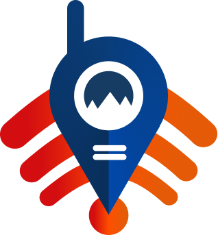

<div align="center">
  

  # ANCHORPULSE Mobile — App SAR

  **Aplikasi Android untuk personel SAR** — terhubung lewat Bluetooth Low
  Energy (BLE) langsung ke node SAR yang dibawa di lapangan.
</div>

---

## Apa ini?

Proyek Flutter **terpisah** dari dashboard web (`../dashboard/`) dan firmware
(`../firmware/`). Tidak mengubah keduanya. Dipakai personel SAR yang membawa
node SAR (ESP32 + LoRa + GPS + BLE) untuk:

- Melihat daftar node mesh & statusnya (online/offline/last seen)
- Melihat lokasi node di peta (OSM, tanpa API key)
- Chat tim SAR — dikirim lewat BLE ke node SAR, di-broadcast firmware ke
  seluruh mesh LoRa sebagai paket `PKT_CHAT`
- Terima pesan/paket mesh yang diterima node SAR (tracking, heartbeat, SOS)

**Platform:** Android saja (keputusan desain awal — lihat catatan di bawah).
**Koneksi:** BLE ke **node SAR** yang membawa firmware ber-BLE
(`firmware/point_rescue_SAR/`), BUKAN ke GATEWAY.

---

## Kenapa BLE, bukan Bluetooth Classic?

`flutter_blue_plus` (dan firmware ESP32 `BLEDevice`) memakai **BLE**, bukan
Classic SPP. Ini juga membuat basis kode ini gampang diperluas ke iOS nanti
kalau dibutuhkan (iOS hanya mendukung BLE untuk app pihak ketiga, tidak
Classic SPP) — meski saat ini scope-nya sengaja dibatasi Android saja.

---

## Stack Teknologi

| Bagian | Pilihan | Alasan |
|---|---|---|
| Framework | **Flutter** (Dart) | Satu codebase, bisa diperluas ke iOS nanti tanpa rewrite. |
| BLE | `flutter_blue_plus` | Plugin BLE paling matang & aktif dikembangkan untuk Flutter. |
| State management | `provider` (ChangeNotifier) | Ringan, sedikit boilerplate, paling umum diajarkan — cocok untuk tim yang mixed level. |
| Peta | `flutter_map` + OSM tiles | Konsisten dengan dashboard web (Leaflet+OSM), tanpa API key/biaya. |
| Permission | `permission_handler` | Wajib untuk izin runtime BLE Android 12+. |

---

## Struktur Proyek

```
mobile/
  lib/
    core/
      constants/ble_constants.dart   UUID GATT — HARUS sama dgn firmware SAR
      theme/app_theme.dart           Warna navy/oranye, konsisten dgn dashboard
      utils/time_format.dart         Format waktu relatif (samakan dgn dashboard)
    data/
      models/                        MeshPacket, NodeStatus, ChatMessage
      ble/anchorpulse_ble_service.dart   Wrapper tipis flutter_blue_plus
      repositories/                  ConnectionRepository, NodeRepository, ChatRepository
    presentation/
      app.dart                       Wiring Provider + MaterialApp
      screens/                       connect, home_shell, node_list, map, chat
      widgets/                       node_tile, connection_status_bar
    main.dart
  android/                           Hasil `flutter create`, sudah dikonfigurasi izin BLE
  assets/logo.png
```

---

## Menjalankan

### Prasyarat
- Flutter SDK (channel stable) — `flutter --version` untuk cek.
- Android Studio / Android SDK + minimal satu device Android **fisik**
  (emulator tidak punya radio Bluetooth asli, jadi tidak bisa dipakai untuk
  fitur BLE — hanya berguna untuk cek UI/navigasi tanpa koneksi nyata).
- Satu node SAR yang sudah di-flash firmware terbaru
  (`firmware/point_rescue_SAR/`, yang sudah menyertakan modul BLE).

### Langkah

```bash
cd mobile
flutter pub get
flutter run           # dengan device Android fisik tersambung USB/wireless debugging
```

Di HP:
1. Buka app → izinkan permission Bluetooth & Lokasi saat diminta.
2. Tekan **"Cari Node SAR"** → app scan BLE, filter berdasar service UUID
   `ANCHORPULSE Bridge` (lihat `docs/protokol-paket.md` §8).
3. Pilih node SAR yang muncul di daftar → tersambung otomatis ke 3 tab:
   **Node** (daftar & status), **Peta** (lokasi), **Chat** (pesan tim).

### Build APK & pakai TANPA laptop (mandiri)

`flutter run` menjalankan app **sambil tersambung ke laptop lewat USB** (untuk
hot-reload/debug). Kalau kabel dicabut, muncul "Lost connection to device" —
itu hanya sesi debug-nya yang putus, **appnya tetap jalan di HP**. Tapi untuk
pemakaian lapangan yang benar-benar mandiri, **install APK-nya**:

```bash
flutter build apk --release      # APK produksi (disarankan untuk lapangan)
# atau: flutter build apk --debug (lebih besar & lebih lambat)
```
APK ada di `build/app/outputs/flutter-apk/app-release.apk`. Salin ke HP, buka
file-nya untuk install (izinkan "Install from unknown sources" bila diminta).
Setelah terinstall, app jalan sendiri tanpa laptop.

Node SAR-nya sendiri **tidak butuh GATEWAY maupun laptop** untuk terhubung ke
HP — koneksi HP ⇄ node SAR murni Bluetooth lokal.

---

## Troubleshooting koneksi Bluetooth

**App minta izin Bluetooth/Lokasi terus, atau scan tidak menemukan apa pun:**
- App sekarang meminta izin **sesuai versi Android**: di Android 12+ hanya
  "Perangkat di sekitar" (Nearby devices / BLUETOOTH_SCAN+CONNECT), TIDAK minta
  lokasi. Kalau tetap ditolak, buka **Settings → Apps → ANCHORPULSE →
  Permissions → Nearby devices → Allow**, lalu ulangi.
- Pastikan **Bluetooth HP menyala** (app akan minta menyalakannya otomatis).
- Pastikan node SAR menyala & Serial Monitor menampilkan
  `[BLE] GATT server siap — advertising ...`.

**Node SAR tidak muncul di daftar scan:**
- Setelah update ini, **wajib flash ulang** firmware SAR — advertising diperbaiki
  agar nama & UUID tidak overflow paket 31-byte (kalau tidak, HP bisa gagal
  menemukannya).
- App mencocokkan node dari **nama** (`ANCHORPULSE-SAR-...`) maupun **service
  UUID**, jadi salah satu cukup.
- Dekatkan HP ke node SAR (< 5 m) saat pertama kali scan.

---

## Verifikasi yang sudah dilakukan

Lingkungan pengembangan ini punya Flutter SDK tapi **tidak** punya device
Android fisik untuk uji BLE end-to-end. Yang sudah diverifikasi:
- `flutter analyze` — bersih, tanpa error/warning.
- `flutter test` — smoke test `AnchorpulseApp` lolos (render ConnectScreen).
- `flutter build apk --debug` — build Android penuh (lihat catatan build di riwayat kerja).
- Semua nama API `flutter_blue_plus` (BluetoothDevice.connect/discoverServices/
  requestMtu via `mtu:`, BluetoothCharacteristic.setNotifyValue/lastValueStream/
  write/read, Guid.str128) diperiksa langsung dari source package yang ter-install
  di pub cache — bukan ditebak dari ingatan.

**Yang BELUM bisa diverifikasi di sini** (perlu kamu uji di hardware asli):
- Koneksi BLE nyata ke ESP32 (scan, connect, discover service, notify, write).
  Perbaikan izin (sadar-versi Android), cek Bluetooth aktif, dan pencocokan node
  by nama+UUID sudah lolos `flutter analyze` + build APK, tapi hasil scan nyata
  tetap harus dicoba di HP + node SAR asli (firmware SAR **wajib di-flash ulang**
  setelah perbaikan advertising).
- Ukuran paket JSON vs MTU — sudah diminta MTU 247 saat connect, tapi perilaku
  MTU negotiation ESP32 Arduino BLE stack bisa bervariasi antar board/versi core;
  kalau ada paket tracking yang gagal ter-parse di app (silent, di-skip), coba
  turunkan payload atau cek log Serial firmware untuk `[BLE]`.
- Reconnect setelah node SAR restart/keluar jangkauan (BleServerCallbacks
  firmware sudah re-advertise otomatis; sisi app belum ada auto-reconnect,
  harus scan+connect ulang manual dari ConnectScreen).

---

## Batasan / pengembangan lanjutan

- Belum ada penyimpanan riwayat chat permanen (hilang saat app ditutup) —
  cukup untuk sesi operasi tunggal, bisa ditambah `hive`/`sqflite` nanti.
- Belum ada auto-reconnect BLE otomatis di background.
- Belum ada dukungan iOS (butuh review ulang permission Info.plist + testing
  BLE terpisah, meski secara arsitektur sudah BLE-only sehingga jalur ini
  paling gampang buat lanjutan berikutnya dibanding kalau pakai Classic SPP).
